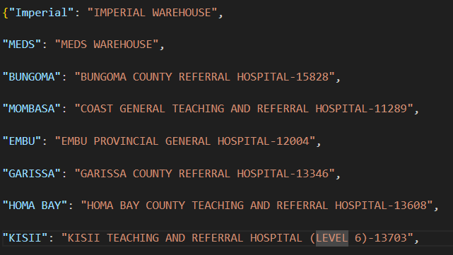
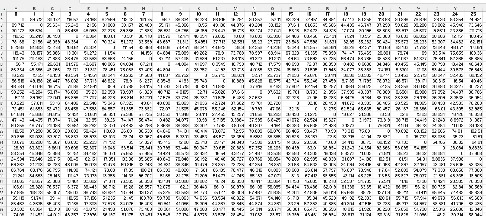

# Distribution Route Optimizer (DRO) Solution

## Solutions contained in this repository

1. Standard Delivery Route Optimizer
2. Fleet Restriction Generation Template and Script
3. Truck Assignment Optimization to ensure most optimal truck assignments (Posthoc Analysis; Ensures Optimal Assignment for Predefined_Routes)

## Setting Configurations for VRP Optimizer

Prior to running the streamlit application, configure `country_cfg.toml` with country specific information including:

1. Country Name (country_name)
2. Tool Display Name (tool_title)
3. Currency (currency)

For `drt_functionaility`, list either `True` or `False` next to each specific entry to enable or disable the particular functionality of the application when the app is run.

For `dro_specs` and `baseline`, list either `True` or `False` for the specific optimization functionalities to either include or not include toggles for an optimization restriction to be customizable (i.e. allow users to constrain or not constrain based on specifc parameters in the application itself).

## Important Checks Prior to Running any Solution

Prior to running, it is essential to verify the following:

1. There exists a folder in `./data` that matches the country name specified in `country_cfg.toml` with the first letter of each word captialized. This folder should be modeled after the sample `./data/COUNTRY/` folder
2. All files in folder specified above are accurate; this includes the `warehouse_mapping.json` file.

## How to Run Standard Delivery Route Optimizer

To run locally:

1. Git clone the repository.

2. Create virtual environment and activate it
    - `python -m venv .venv`
    - `source .venv/Script/activate`

    Note: Once the virtual environment is created, the environment must be activated each time starting a new session.

    Note: A conda environment can also be used if preferred.

3. Install all requirements: 
    - `pip install -r requirements.txt`
    - Go into the lib folder and install psm library: `pip install psm-X.X.X-py3-none-any.whl`

4. Add a folder called `filestore`.

5. Ensure `country_cfg.toml` is updated with information above:

6. Ensure that you unzip the file `{Country}_DRT_Files.zip` and have all the DRT files directly in the `data/{Country}` folder. More information on how to complete this file below.

7. Run the app in terminal!
    - `streamlit run app.py`

## Filling out Order Evaluation Template

For this file, the Order Details Tab should be populated first with the order line information. For this sheet, be sure to first unhide all of the columns in order to show all fields. Once this is done. This sheet will be crucial for filling out the Order Info and Delivery Sheets in the document. For the Order Info sheet, the Order Details sheet should be aggregated based on Customer Order Number/Customer Name to get information on the total volume for the order. This will be achieved by using UNIQUE(), VLOOKUP(), and SUMIF() functions based in excel. Once this sheet is complete, the Delivery sheet can be populated using the Order Info. For this sheet, the route field needs to be filled out for the specific customer names as appropriate (this field is critical for the predefined routes functionality). Also note that the loading weight is typically set to 1. This is because volume typically is the limiting factor for these dispatches. Based on this, the volumetric data should be populated. With this, now fill out the Facility Ref sheet. The Parameters sheet does not need to be populated. 

## Filling out DRT Files

Filling out the DRT Files, the following sheets need to be complete: Facility, Links, Distance, Time , Cubage, Fleet, Fleet Excusions, Facility Groups Distance Adj and Parameters.

- For the Facility Sheet, fill out all of the fields in the table, be sure that a warehouse listed in the warehouse_mapping json file is listed in the first row of the facility table.

*Note: The name used on the left must match with the location in the DRT file name, and the name on the right must be a facility sheet.

- For the Links sheet (optional), this can contain information for how the distance matrix was used. **This is not needed for the optimization.**

- For the Distance Sheet, insert a distance matrix. At GHSC-PSM, the distance matrix we have a internal-matrix-management document can be used.  For others This will need to generated using existing matrix or built via tools like [Open Route Service](https://openrouteservice.org/). In particular, [Open Route Services Matrix API](https://openrouteservice.org/dev/#/api-docs/v2/matrix) calls enable users to get the distance from one location to all other locations quickly. These calls can then be stacked to populate the full distance matrix. 

- For the Time Sheet, simply copy over the matrix from the distance sheet and divide all values by the speed assumption for the analysis.

- For the Cubage Sheet (optional), list record of the product codes and names with associated volumes for record keeping.

- For the Fleet Sheet, list all of the trucks available with its source (warehouse) location and note associated constraints and costs associated with the fleet. Note: base_cost is a fixed price for distance travelled where as fixed_cost is a flat cost applied to the total.

- For the Fleet Exclusions Sheet, list trucks and source location in addition to which locations the trucks cannot go, these will be loaded into the DRO app but can be toggled in the app itself.

- For the Facility Groups Sheet (optional), allows for specific facilities to be delivered to in same dispatch.

- For the Distance Adj Sheet (optional), allows for specific facility adjacencies to be specified for two facilities (i.e. from one to another and the distance).

- For the Parameters Sheet (optional), set the parameters that you want to be autopopulated into the solve scenario component of the DRO application,

## Replicating Predefined Routes

If historical route information is available, it is possible to generate a baseline cost associated with these historical routes using the Predefined Routes. A baseline scenario optimization can be conducted by setting the `predefined_routes` option to `True` in the `baseline` portion of the `country_config.toml` file. This will allow for the toggle to become available in the Order Evaluation portion of the application. With this toggle on, the application will find the optimal route for predefined routes listed in the Order Evaluation File that is uploaded. This in most cases will provide the optimal solution; however, there are few circumstances where this will not be the case:

1. A predefined route is separated into two or more route as this would be more optimal. If this occurs, a message will be displayed to the user noting that this has in fact occurred. Additional steps would be necessary to correct this such as manually changing the fix cost in the DRT Fleet Tab and re-running the application.  *Note: this is a rare occurence that is likely to not occur.*
2. If all vehicles of a specific type are used prior to completing the predefined_routes optimization, the `truck_optimize` optimization will ensure the most optimal assignment of trucks to specific routes in order to ensure that the most optimal route is presented.

## Generating the Fleet Restrictions:

To generate the fleet restrictions for a DRT file, use and fill out sample template: `Fleet_Restriction_Template.xlsx`. In this file, you will find instructions on how to complete this template. Once this is complete saved the updated file.

Open `fleet_exclusion.py` in VSCode and update `fname` (located at the bottom of the code) with the path to the completed Fleet Restriction Template. Then open terminal and run:

`python fleet_exclusion.py`

This will create a new xlsx file. The first sheet in the workbook can be copied into the DRT Fleet Restriction sheet. The second sheet contains quality checks to ensure that the volume at the facility is not greater than the volume capacity of the largest vehicle that can get to the facility. This check is to ensure that the DRO Optimizer does not encounter problems when working to produce optimization results.

## Running the Truck Optimization Process:

To run the Truck Optimization, first open `truck_optimize.py` in VSCode and update `scenario_file_path` (located at the bottom of the code) with the path to the scenario where there is interest in running the post-hoc truck optimization. Save these changes.

Finally, run the following command:

`streamlit run truck_optimize.py`

Once the optimization is complete, it will say so and state that the file has been saved.

### Key Files:

**Python Files**

- `app.py`
- `app_admin.py`
- `app_login.py`
- `app_drorders.py`
- `app_upload.py`
- `app_refine.py`
- `app_optimize.py`
- `app_review.py`
- `app_release_notes.py`
- `DRO.py`
- `SessionState.py`
- `Scenario.py`
- `map_utils.py`
- `matrix_utils.py`

**Other Files**
- `country_cfg.toml`
- `credentials.ini`
- `requirements.txt`
